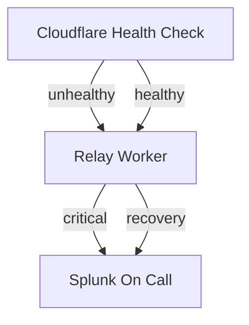

# Cloudflare Health Check → Splunk On-Call 

☁️ Cloudflare Edge Worker to relay Health Check messages to Splunk On-Call (FKA Victorops)

> I'm using fake keys and domain names in this document

## Splunk On-Call REST API

Retreive your API key from Splunk On-Call:

| 
| -
| `https://alert.victorops.com/integrations/generic/20131114/alert/e948df8a-1579-4fd0-85f1-985edfa98950/$routing_key`

## Cloudflare Edge Worker

Create an edge worker with the name `health-check-to-splunk-on-call` (suggestion)

|  
| -

## Cloudflare Notification Destination

Configure a notification destination webhook on Cloudflare

- **Name**: Descriptive name
- **URL**: `https://health-check-to-splunk-on-call.my-worker-subdomain.workers.dev/<ROUTING_KEY>`
- **Secret**: Splunk On-Call API key

Use the API key from Splunk On-Call as the secret:

|  
| -

## Data Schemas

### Cloudflare Health Check Webhook Payload

- **name**: [`String`] Notification name
- **text**: [`String`] Check name, Check ID, Time, Status
- **data**:
  - **time**: [`String`] 'YYYY-MM-DD HH:mm:ss +0000 UTC'
  - **status**: Healthy | Unhealthy
  - **reason**: [`String`] Response code mismatch error, No failure
  - **name**: [`String`] test_name
  - **health_check_id**: [`String`]
  - … more arbitrary information

### Splunk On-Call REST endpoint API

> [Splunk On-Call REST endpoint documentation](https://help.victorops.com/knowledge-base/rest-endpoint-integration-guide/)

- **message_type**: CRITICAL | WARNING | ACKNOWLEDGEMENT | INFO | RECOVERY
- **entity_id**: [`String`]
- **entity_display_name**: [`String`]
- **state_message**: [`String`]
- **state_start_time**: [`Number`] (Linux/Unix time)

---

## Notification

Add the Splunk relay destination to your notification.

> Make sure you choose "Becomes healthy or unhealthy" to ensure incidents will be automatically resolved when applicable.

|  
| -
